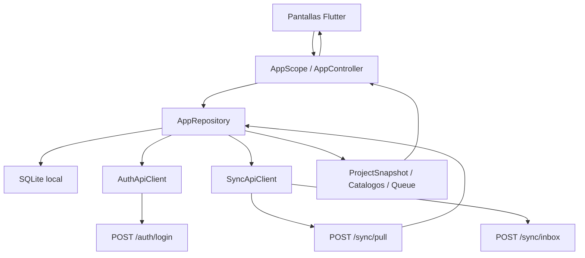
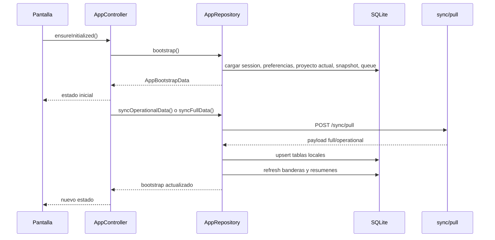
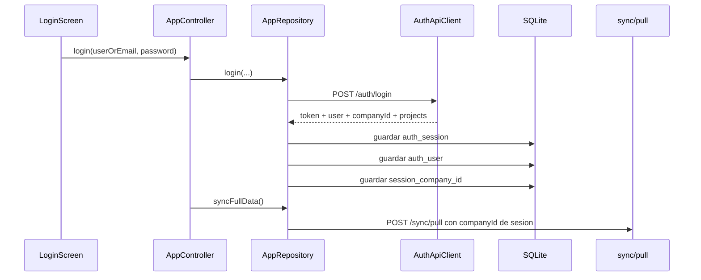
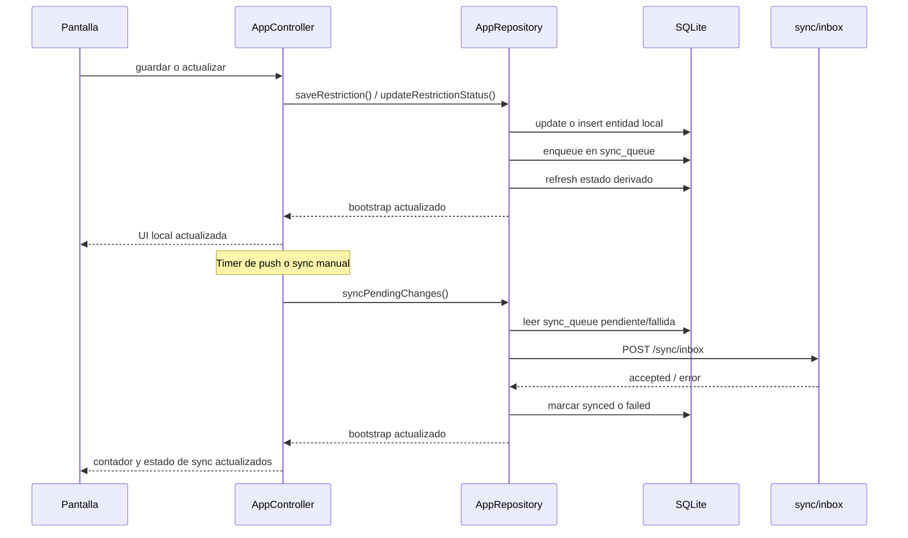
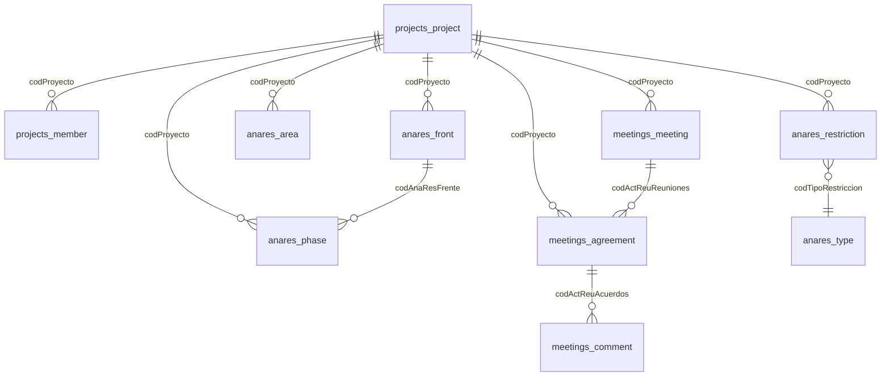
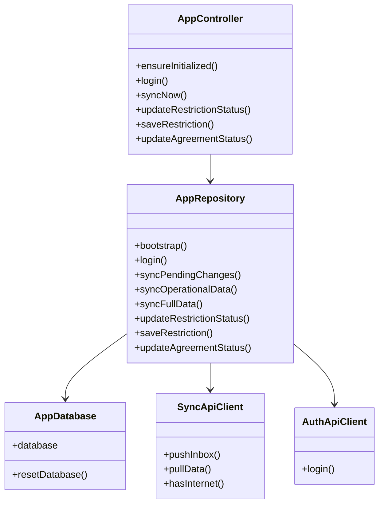

# Direktor App V2 - Documentacion Tecnica

## 1. Objetivo

Este documento describe la arquitectura tecnica actual de `direktor_appv2`, su base de datos SQLite local, la integracion con APIs remotas, los flujos de sincronizacion automatica y manual, y los payloads que la app envia y recibe.

La documentacion esta basada en el codigo actual del proyecto, principalmente en:

- `lib/app/state/app_controller.dart`
- `lib/data/app_repository.dart`
- `lib/data/local/app_database.dart`
- `lib/data/remote/auth_api_client.dart`
- `lib/data/remote/sync_api_client.dart`
- `assets/db/direktor_mobile_v2.sql`

## 2. Vista General

La app sigue un enfoque `offline-first`:

- La informacion operativa vive en SQLite.
- Las pantallas consumen el estado del `AppController`.
- El `AppRepository` concentra la logica de negocio, persistencia y sincronizacion.
- La app descarga datos desde `sync/pull`.
- La app encola cambios locales en `sync_queue`.
- Un proceso periodico intenta enviar esa cola al endpoint `sync/inbox`.

## 3. Mapa de Arquitectura



## 4. Componentes Principales

### 4.1 `AppController`

Responsabilidades:

- Cargar bootstrap inicial.
- Exponer estado observable a las pantallas.
- Iniciar watchers de conectividad.
- Ejecutar los loops automaticos de sincronizacion.
- Ejecutar sincronizacion manual.

Comportamientos principales:

- Al inicializar:
  - llama a `repository.bootstrap()`
  - inicia observador de conectividad
  - inicia timers de sync
  - ejecuta chequeos automaticos
- Al hacer login remoto exitoso:
  - actualiza estado local
  - ejecuta `full sync` si la sync remota esta habilitada y no hay modo offline
- En `resume` de la app:
  - refresca estado
  - reevalua sincronizaciones pendientes

Archivo:

- `lib/app/state/app_controller.dart`

### 4.2 `AppRepository`

Es la capa central del dominio. Maneja:

- login local y remoto
- cambio de proyecto
- creacion/edicion de restricciones
- cambio de estado de restricciones
- cambio de estado de acuerdos
- lectura y escritura de SQLite
- armado de payloads de sync
- `pull` y `push`
- refresco de banderas derivadas y resumenes

Archivo:

- `lib/data/app_repository.dart`

### 4.3 `AppDatabase`

Responsabilidades:

- abrir SQLite
- ejecutar el schema inicial
- asegurar columnas y estructuras necesarias en apertura
- seed inicial para entorno local/demo

Archivo:

- `lib/data/local/app_database.dart`

### 4.4 Clientes remotos

#### `AuthApiClient`

- endpoint: `POST {DIREKTOR_API_BASE_URL}/auth/login`
- envia: `userOrEmail`, `password`, `keepSignedIn`, `source`
- recibe token, refresh token, user y proyectos

Archivo:

- `lib/data/remote/auth_api_client.dart`

#### `SyncApiClient`

- `POST {DIREKTOR_API_BASE_URL}/sync/pull`
- `POST {DIREKTOR_PUSH_INBOX_URL}/sync/inbox`

Archivo:

- `lib/data/remote/sync_api_client.dart`

### 4.5 Modulo `Control de Hitos`

Estado actual:

- implementado en frontend con datos mock
- aun sin persistencia SQLite propia ni integracion backend real
- alineado visualmente con el resto de la app, especialmente con `analysis_restrictions`

Pantallas principales:

- `Control de Hitos - Lista`
- `Control de Hitos - Timeline`
- `Detalle de Hito`
- `Nuevo / Editar Hito`
- `Nueva Ampliacion`
- `Lista de Ampliaciones`
- `Documentos`

Archivos principales:

- `lib/features/control_hitos/presentation/screens/control_hitos_screen.dart`
- `lib/features/control_hitos/presentation/screens/hito_detail_screen.dart`
- `lib/features/control_hitos/presentation/screens/hito_form_screen.dart`
- `lib/features/control_hitos/presentation/screens/hito_extension_form_screen.dart`
- `lib/features/control_hitos/presentation/screens/hito_extensions_screen.dart`
- `lib/features/control_hitos/presentation/screens/hito_documents_screen.dart`
- `lib/features/control_hitos/presentation/control_hitos_demo_store.dart`

## 5. Flujo de Datos

### 5.1 Flujo general de lectura



### 5.3 Login y sesion remota



Reglas importantes:

- al hacer `logout`, se elimina `auth_session`
- al hacer `logout`, tambien se limpia `session_company_id`
- al hacer un nuevo `login`, se guarda el `companyId` del usuario autenticado
- `sync/pull` toma primero `session_company_id` para evitar reutilizar una compania de una sesion anterior

### 5.2 Flujo general de escritura



## 6. Base de Datos Local

La definicion base vive en:

- `assets/db/direktor_mobile_v2.sql`

### 6.1 Tablas principales

#### Autenticacion

- `auth_session`
- `auth_user`

#### Proyectos y catalogos de proyecto

- `projects_project`
- `projects_member`
- `projects_area_member`

#### Analisis de restricciones

- `anares_front`
- `anares_phase`
- `anares_type`
- `anares_area`
- `anares_status`
- `anares_restriction`
- `anares_summary`

#### Reuniones

- `meetings_meeting`
- `meetings_participant`
- `meetings_agreement`
- `meetings_comment`
- `meetings_summary`

#### Sincronizacion

- `sync_queue`
- `sync_log`
- `app_settings`

Configuraciones relevantes en `app_settings`:

- `keep_signed_in`
- `current_project_id`
- `last_sync_at`
- `last_daily_full_sync_business_date`
- `session_company_id`

### 6.2 Relaciones funcionales relevantes



### 6.3 Tabla `sync_queue`

Rol:

- cola local de mutaciones pendientes de enviar

Columnas clave:

- `id`
- `entity_type`
- `entity_id`
- `operation_type`
- `payload_json`
- `status`
- `retry_count`
- `error_message`
- `created_at`
- `updated_at`

Comportamiento actual:

- el `id` se genera de forma grande y unica usando `DateTime.now().microsecondsSinceEpoch`
- si existieran pendientes viejos con ids pequenos, se normalizan antes de enviar
- ese mismo `id` es el `queueId` enviado al backend

### 6.4 Tabla `app_settings`

Uso actual:

- `db_version`
- `last_sync_at`
- `current_project_id`
- `offline_mode`
- `remote_sync_enabled`
- `last_sync_version`
- `last_daily_full_sync_business_date`
- `keep_signed_in`

## 7. Login y Sesion

### 7.1 Login remoto

Endpoint:

- `POST /auth/login`

Request:

```json
{
  "userOrEmail": "usuario@empresa.com",
  "password": "******",
  "keepSignedIn": true,
  "source": "direktor_appv2"
}
```

Respuesta esperada:

- `token`
- `refreshToken`
- `user`
- `projects`

Persistencia local posterior:

- `auth_user`
- `auth_session`
- `projects_project`
- setting `keep_signed_in`
- setting `current_project_id`

### 7.2 Login local

Solo funciona como fallback offline si la app esta efectivamente en modo offline.

Valida contra:

- `auth_user.email`
- `auth_user.name`
- `auth_user.password`

## 8. Endpoints de Sincronizacion

### 8.1 Pull

URL base actual:

- `https://desaapi.direktor.com.pe/api/mobile/sync/pull`

Request actual:

```json
{
  "userId": 19,
  "source": "direktor_appv2",
  "scope": "full",
  "companyId": "SODIMAC",
  "businessDate": "2026-03-13",
  "since": "2026-03-13T08:00:00"
}
```

Notas:

- `companyId` se envia si existe
- `businessDate` se calcula con corte operativo a las `06:00`
- `since` solo se envia en sync `operational`

### 8.2 Push

URL base actual:

- `http://31.220.20.226/api/mobile/sync/inbox`

Request actual:

```json
{
  "userId": 19,
  "companyId": 1,
  "deviceId": 1,
  "source": "direktor_appv2",
  "items": [
    {
      "queueId": 1741881234567890,
      "entityType": "restriction",
      "entityId": "1741880000000011",
      "operationType": "update",
      "payload": "{\"codAnaResActividad\":1741880000000011,\"codProyecto\":76,\"codEstadoActividad\":\"3\",\"desEstadoActividad\":\"Completado\"}"
    }
  ]
}
```

Notas importantes:

- `queueId` sale de `sync_queue.id`
- `payload` se envia como string JSON serializado
- para `restriction`, si antes existia `status_update`, al enviar se normaliza a `update`

## 9. Sincronizacion Automatica

### 9.1 Timers activos

Definidos en `AppController._startSyncLoops()`

- Push loop: cada `30 segundos`
- Loop de chequeo operativo: cada `1 minuto`

### 9.2 Regla de push automatico

El timer de `30 segundos` ejecuta `_tryPushSync()`.

El push solo corre si:

- la app esta inicializada
- hay sesion activa
- no esta ocupada ni ya sincronizando
- `remote_sync_enabled = true`
- no esta en modo offline efectivo
- la API esta configurada
- existe al menos un item `pending` o `failed` en `sync_queue`

### 9.3 Regla de sync operacional automatica

El timer de `1 minuto` ejecuta `_tryOperationalSyncIfNeeded()`.

`shouldRunOperationalSync()` devuelve `true` si:

- hora actual entre `06:00` y `18:59`
- y `last_sync_at` es nulo, o
- han pasado `30 minutos` o mas desde la ultima sync exitosa

### 9.4 Regla de full sync diaria

`shouldRunDailyFullSync()` devuelve `true` si:

- hora actual es `>= 06:00`
- y `last_daily_full_sync_business_date` es distinta de la fecha operativa actual

La fecha operativa:

- usa el dia actual si la hora es `>= 06:00`
- usa el dia anterior si la hora es `< 06:00`

Ejemplo:

- `2026-03-13 05:30` => business date `2026-03-12`
- `2026-03-13 06:10` => business date `2026-03-13`

### 9.5 Otros disparadores de sync

- `login` remoto exitoso:
  - ejecuta `full sync`
- cambio de conectividad a online:
  - refresca estado y corre chequeos automaticos
- `AppLifecycleState.resumed`:
  - refresca estado y corre chequeos automaticos
- accion manual `syncNow()`:
  - hace push y luego sync operacional
  - o hace full sync si `syncAllOnNextManual = true`

## 10. Reglas de Persistencia y Merge

### 10.1 Pull `full`

En `scope = full` se hace upsert de:

- proyectos
- areas generales
- areas de analisis
- tipos
- statuses
- members
- frentes
- fases
- participantes
- restricciones
- reuniones
- acuerdos
- comentarios

### 10.2 Pull `operational`

En `scope = operational` se actualizan principalmente:

- restricciones
- reuniones
- acuerdos
- comentarios

Si el payload operacional trae proyectos nuevos no existentes localmente:

- la app fuerza un `pull full`

### 10.3 Politica frente a cambios locales pendientes

Si llega una entidad remota y existe un item pendiente/fallido en `sync_queue` para esa misma entidad:

- se conserva el cambio local pendiente
- se registra conflicto en `sync_log`

Esto aplica actualmente en:

- restricciones
- acuerdos

## 11. Eventos que Encolan Cambios

### 11.1 Restriccion - cambio de estado

Metodo:

- `AppRepository.updateRestrictionStatus()`

Efectos:

- actualiza `anares_restriction`
- marca `sync_status = pending`
- actualiza `dayFechaModificacion`
- recalcula banderas internas
- encola item `restriction / update`

Payload:

- fila completa de `anares_restriction` leida desde SQLite

### 11.2 Restriccion - crear

Metodo:

- `AppRepository.saveRestriction()` con `draft.id == null`

Efectos:

- genera `codAnaResActividad` grande y unico
- inserta registro en `anares_restriction`
- si hace falta, crea `anares_area`
- encola `restriction / create`

Payload:

- fila completa de `anares_restriction`

### 11.3 Restriccion - editar

Metodo:

- `AppRepository.saveRestriction()` con `draft.id != null`

Efectos:

- actualiza `anares_restriction`
- marca `sync_status = pending`
- encola `restriction / update`

Payload:

- fila completa de `anares_restriction`

### 11.4 Analysis area - create

Metodo:

- `_resolveRestrictionAreaSelection()`

Solo crea area nueva si:

- el area seleccionada no es ya de tipo `anares:*`
- y no existe combinacion `codProyecto + codArea` en `anares_area`

Efectos:

- crea `anares_area`
- encola `analysis_area / create`

Payload:

- fila completa de `anares_area`

### 11.5 Agreement - update

Metodo:

- `AppRepository.updateAgreementStatus()`

Efectos:

- actualiza `meetings_agreement`
- recalcula `desEstado`, `desGrupoAcuerdo`, colores y banderas
- encola `agreement / update`

Payload actual:

```json
{
  "codActReuAcuerdos": 601,
  "codEstado": "completed"
}
```

## 12. Estados de Restriccion

### 12.1 Regla actual

La app conserva:

- `codEstadoActividad`: codigo real del backend
- `desEstadoActividad`: descripcion real del backend

La UI y las banderas internas ya no dependen de reescribir ese codigo.

La clasificacion visual/funcional se deriva por:

- `codElementoControl` del catalogo `anares_status`, o
- `desEstadoActividad`, si se necesita inferencia adicional

Clasificacion interna actual:

- control 3 => `completed`
- control 2 => `in_progress`
- resto => `pending`

## 13. Payloads Reales Relevantes

### 13.1 Pull full

```json
{
  "userId": 19,
  "companyId": "SODIMAC",
  "scope": "full"
}
```

### 13.2 Push restriction update

```json
{
  "userId": 19,
  "companyId": 1,
  "deviceId": 1,
  "source": "direktor_appv2",
  "items": [
    {
      "queueId": 1741881234567890,
      "entityType": "restriction",
      "entityId": "1741880000000011",
      "operationType": "update",
      "payload": "{\"codAnaResActividad\":1741880000000011,\"codProyecto\":76,\"codEstadoActividad\":\"3\",\"desEstadoActividad\":\"Completado\",\"colorEstado\":\"#1B8E5A\"}"
    }
  ]
}
```

### 13.3 Push restriction create

```json
{
  "items": [
    {
      "queueId": 1741881234567891,
      "entityType": "restriction",
      "entityId": "1741880000000012",
      "operationType": "create",
      "payload": "{...fila completa de anares_restriction...}"
    }
  ]
}
```

### 13.4 Push analysis area create

```json
{
  "items": [
    {
      "queueId": 1741881234567892,
      "entityType": "analysis_area",
      "entityId": "1741880000000020",
      "operationType": "create",
      "payload": "{...fila completa de anares_area...}"
    }
  ]
}
```

## 14. IDs Locales Grandes y Unicos

### 14.1 `sync_queue.id`

Se genera con:

- `DateTime.now().microsecondsSinceEpoch`

Uso:

- PK local
- `queueId` enviado al backend

### 14.2 `anares_restriction.codAnaResActividad`

Nuevos registros locales usan:

- `DateTime.now().microsecondsSinceEpoch`

Si colisiona:

- incrementa `+1` hasta encontrar uno libre

### 14.3 `anares_area.codAnaresArea`

Nuevas areas de analisis locales usan:

- `DateTime.now().microsecondsSinceEpoch`

## 15. Mapa de Clases Tecnicas



## 16. Riesgos / Consideraciones

- El push de `payload` se envia como string JSON serializado, no como objeto.
- El backend de `sync/inbox` es sensible a duplicados por `queueId` o validaciones equivalentes.
- El modelo de restricciones ya debe tratar `codEstadoActividad` como ID real, no como alias textual.
- Las reuniones/acuerdos aun mantienen parte de la logica antigua basada en estados normalizados (`pending`, `completed`), especialmente en acuerdos.
- El `companyId` del `pull` debe salir de la sesion remota vigente; por eso se persiste `session_company_id` y se limpia al cerrar sesion.
- `Control de Hitos` esta aun en etapa frontend/demo; no debe asumirse como modulo sincronizado ni persistido en SQLite todavia.
- La version Word entregada con este paquete esta en formato RTF para facilitar apertura directa en Microsoft Word sin depender de herramientas externas.

## 17. Archivos Tecnicos Clave

- `lib/app/state/app_controller.dart`
- `lib/data/app_repository.dart`
- `lib/data/local/app_database.dart`
- `lib/data/remote/auth_api_client.dart`
- `lib/data/remote/sync_api_client.dart`
- `lib/features/analysis_restrictions/presentation/screens/restrictions_list_screen.dart`
- `lib/features/analysis_restrictions/presentation/screens/restriction_form_screen.dart`
- `lib/features/control_hitos/presentation/screens/control_hitos_screen.dart`
- `lib/features/control_hitos/presentation/screens/hito_detail_screen.dart`
- `lib/features/control_hitos/presentation/screens/hito_form_screen.dart`
- `lib/features/control_hitos/presentation/screens/hito_extension_form_screen.dart`
- `lib/features/control_hitos/presentation/screens/hito_extensions_screen.dart`
- `assets/db/direktor_mobile_v2.sql`
- `docs/openapi_sync.yaml`
- `docs/backend_sync_contract.md`

## 18. Recomendaciones para Confluence

- Pegar este archivo en una pagina usando el editor Markdown o pegado enriquecido.
- Mantener los bloques Mermaid como macros Mermaid si el espacio de Confluence los soporta.
- Si Confluence no soporta Mermaid, convertir esos diagramas a imagen o dejar el bloque de codigo.
